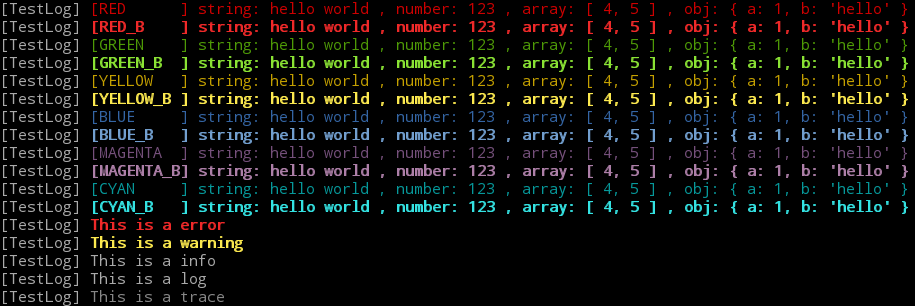

# cpclog.js

A cross platform(node and webpacked-browser) colorful log for js.

# Install

    npm install cpclog.js

# Usage

``` javascript

    const Logger = require('../index.js');

    const logger = Logger.createWrapper('TestLog', Logger.LEVEL_TRACE);

    function testLog() {
        let segments = ['string:', 'hello world', ', number:', 123, ', array:', [4, 5], ', obj:', {a: 1, b: 'hello'}];

        // With color
        logger.info(Logger.RED         , '[RED      ]', ...segments);
        logger.info(Logger.RED_B       , '[RED_B    ]', ...segments);
        logger.info(Logger.GREEN       , '[GREEN    ]', ...segments);
        logger.info(Logger.GREEN_B     , '[GREEN_B  ]', ...segments);
        logger.info(Logger.YELLOW      , '[YELLOW   ]', ...segments);
        logger.info(Logger.YELLOW_B    , '[YELLOW_B ]', ...segments);
        logger.info(Logger.BLUE        , '[BLUE     ]', ...segments);
        logger.info(Logger.BLUE_B      , '[BLUE_B   ]', ...segments);
        logger.info(Logger.MAGENTA     , '[MAGENTA  ]', ...segments);
        logger.info(Logger.MAGENTA_B   , '[MAGENTA_B]', ...segments);
        logger.info(Logger.CYAN        , '[CYAN     ]', ...segments);
        logger.info(Logger.CYAN_B      , '[CYAN_B   ]', ...segments);
        logger.info('Multi color in one line:', Logger.RED_B, 'RED_B,', Logger.GREEN_B, 'GREEN_B,', Logger.BLUE_B, 'BLUE_B,', Logger.CLR, 'and no color');

        // With level
        logger.error('This is a error');
        logger.warn('This is a warning');
        logger.info('This is a info');
        logger.debug('This is a log');
        logger.trace('This is a trace');
    }

    testLog();

```

**Note:** because yellow in white background(in browser) is hard to be seen, So it's set to be
inverted. If you don't like it, you can change it easily by your own color like:

``` javascript

    // Add this before logging:
    Logger.BR_YELLOW   = 'color: darkorange';   // 'BR_' prefix means 'browser'
    Logger.BR_YELLOW_B = 'color: darkorange; font-weight:bold';

    // Then log it:
    logger.info(Logger.YELLOW      , '[YELLOW   ]', 'something yellow to show');
    logger.info(Logger.YELLOW_B    , '[YELLOW_B ]', 'something yellow-bold to show');

```

You can also use this way to override other default colors.

# Demo

In browser:


In node:




