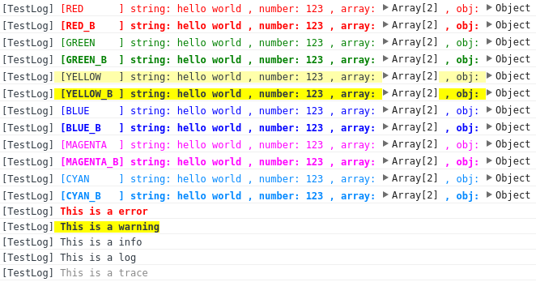

# cpclog.js

A cross platform(node and webpacked-browser) colorful log for js.

github: [https://github.com/mikewootc/cpclogjs](https://github.com/mikewootc/cpclogjs)


# Demo

In browser:



In node:


# Install

    npm install cpclog.js


# Usage

e.g.:

``` javascript

    const Logger = require('cpclog');
    const logger = Logger.createWrapper('LogTestTag', Logger.LEVEL_TRACE);

    function testLog() {
        // With level
        logger.error('This is a error');
        logger.warn('This is a warning');
        logger.info('This is a info');
        logger.debug('This is a debug');
        logger.trace('This is a trace');

        // With color
        let segments = ['string:', 'hello world', ', number:', 123, ', array:', [4, 5], ', obj:', {a: 1, b: 'hello'}];

        logger.info(Logger.RED         , '[RED      ]', ...segments);
        logger.info(Logger.RED_B       , '[RED_B    ]', ...segments);
        logger.info(Logger.GREEN       , '[GREEN    ]', ...segments);
        logger.info(Logger.GREEN_B     , '[GREEN_B  ]', ...segments);
        logger.info(Logger.YELLOW      , '[YELLOW   ]', ...segments);
        logger.info(Logger.YELLOW_B    , '[YELLOW_B ]', ...segments);
        logger.info(Logger.BLUE        , '[BLUE     ]', ...segments);
        logger.info(Logger.BLUE_B      , '[BLUE_B   ]', ...segments);
        logger.info(Logger.MAGENTA     , '[MAGENTA  ]', ...segments);
        logger.info(Logger.MAGENTA_B   , '[MAGENTA_B]', ...segments);
        logger.info(Logger.CYAN        , '[CYAN     ]', ...segments);
        logger.info(Logger.CYAN_B      , '[CYAN_B   ]', ...segments);
        logger.info('Multi color in one line:', Logger.RED_B, 'RED_B,', Logger.GREEN_B, 'GREEN_B,', Logger.BLUE_B, 'BLUE_B,', Logger.CLR, 'and no color');

    }

    testLog();

```

**Note:** because yellow in white background(in browser) is hard to be seen, So it's set to be
inverted. If you don't like it, you can change it easily by your own color like:

``` javascript

    // Add this before logging:
    Logger.BR_YELLOW   = 'color: darkorange';   // 'BR_' prefix means 'browser'
    Logger.BR_YELLOW_B = 'color: darkorange; font-weight:bold';

    // Then log it:
    logger.info(Logger.YELLOW      , '[YELLOW   ]', 'something yellow to show');
    logger.info(Logger.YELLOW_B    , '[YELLOW_B ]', 'something yellow-bold to show');

```

You can also use this way to override other default colors.

# API

### Logger.createWrapper(tag, level)

**tag**: (REQUESTED) the tag for the created wrapper logger, and would be shown in every line of the output log.

This argument should be a string(which is also considered as inner map-key of loggers).

**level**: (REQUESTED) the level shown for this logger. should one of the follow value:

* Logger.LEVEL_TRACE
* Logger.LEVEL_DEBUG
* Logger.LEVEL_INFO 
* Logger.LEVEL_WARN 
* Logger.LEVEL_ERROR

### Logger.adjustTag(tag, level)

This static function adjust the log level for the logger which created by Logger.createWrapper()

**tag**: specify the logger's tag, should be same as in Logger.createWrapper().

**level**: specify the logger's new log level.

e.g.:

``` javascript

    Logger.adjustTag('TestLog', Logger.LEVEL_WARN);

```

